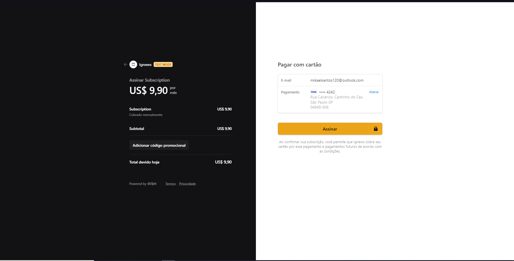

## Getting Started


```bash
npm run dev
# or
yarn dev
```

Esse projeto e um blog, onde é possivel cadastrar novos post atraves de um CMS, apenas usuarios com inscrição ativa tem acesso aos post.

##🚀 Tecnologias
NextJs
stripe
prismicCMS
faunaDB
Sass



  
